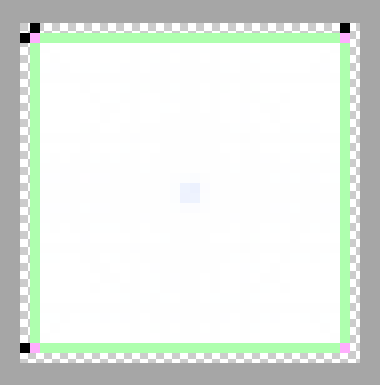

# four-sides-1px-9patcher
Automatically 9-patch image like this.




## Dependencies

Automattic/node-canvas - https://github.com/Automattic/node-canvas

Installing node-canvas is bit difficult. Here is how to on mac.

```bash
$ brew install pkg-config
$ brew install pixman
$ brew install cairo
$ export PKG_CONFIG_PATH=/opt/X11/lib/pkgconfig
```

## Installation
```bash
$ npm install four-sides-1px-9patcher
```

## Usage
```javascript
var fourSides1px9patcher = require('four-sides-1px-9patcher');
fourSides1px9patcher('src.png', 'dst.png');
```

## License

WTFPL - http://www.wtfpl.net/